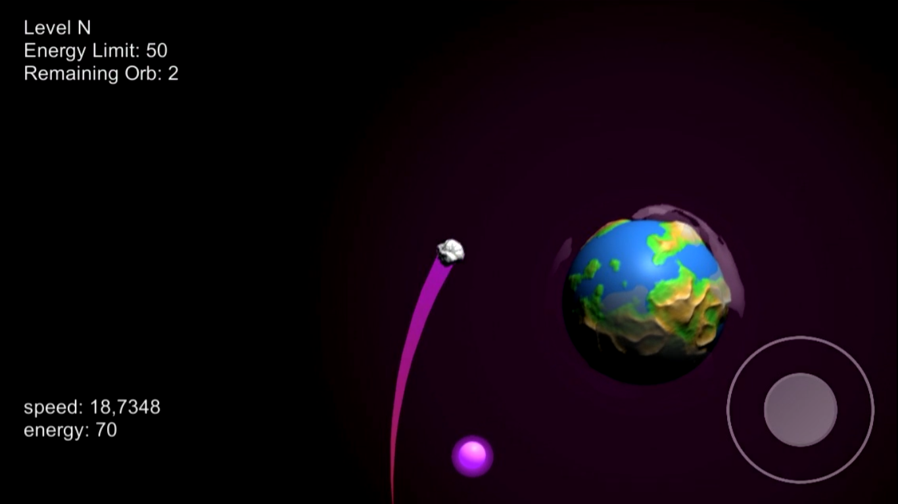

# Space Spin

Space Spin is a mobile game that developed with Unity.

This is a game that I developed alone. I had to do something about my game's graphics. I needed planets, stars etc, so i wanted to generate this objects via code.

I searched this topic on the internet and find a video series in Sebastian Lague's YouTube channel. I used his method to generate planets in my own game. I leave the link of his channel down below.

Here is a screenshot and a video from my game. I recorded this video from my iPhone SE. I hope you'll like it.

Demo Video: https://youtu.be/3jT3gdX_fNY

I switched platform to iOS. You have to switch your target platform and set your screen resolution before running this project.

You can freely use my materials in your projects. I have lots of ideas for this game but im still think about these ideas. This game may change from many aspects.

Sebastian Lague's channel: https://www.youtube.com/user/Cercopithecan
